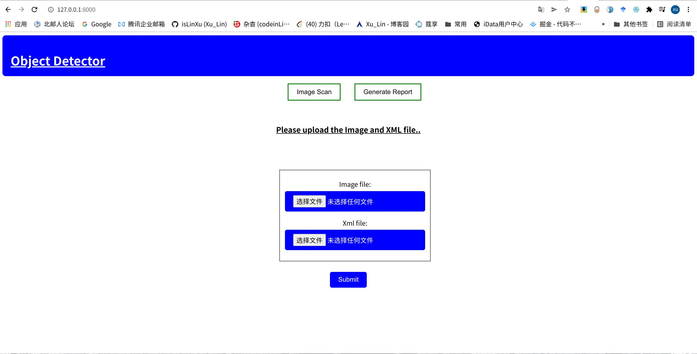
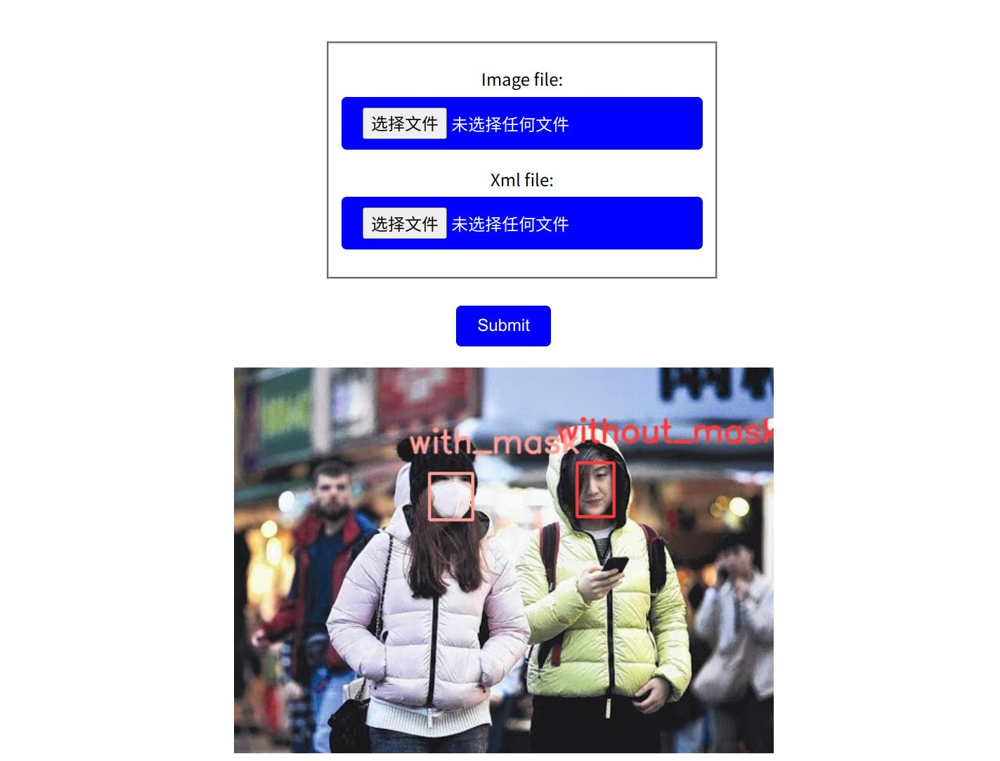
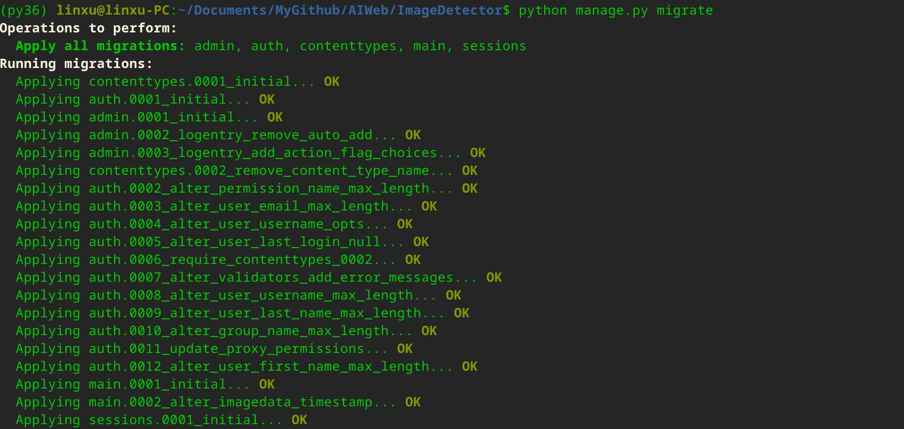
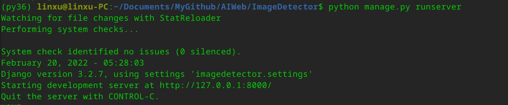
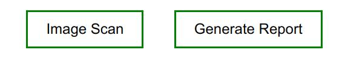
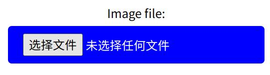
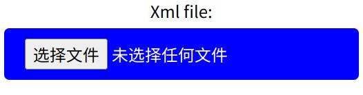
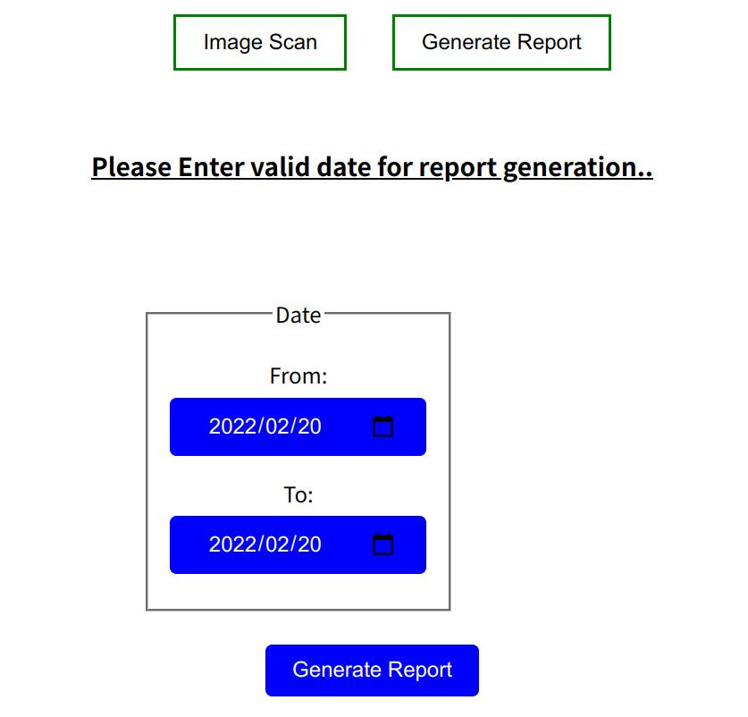
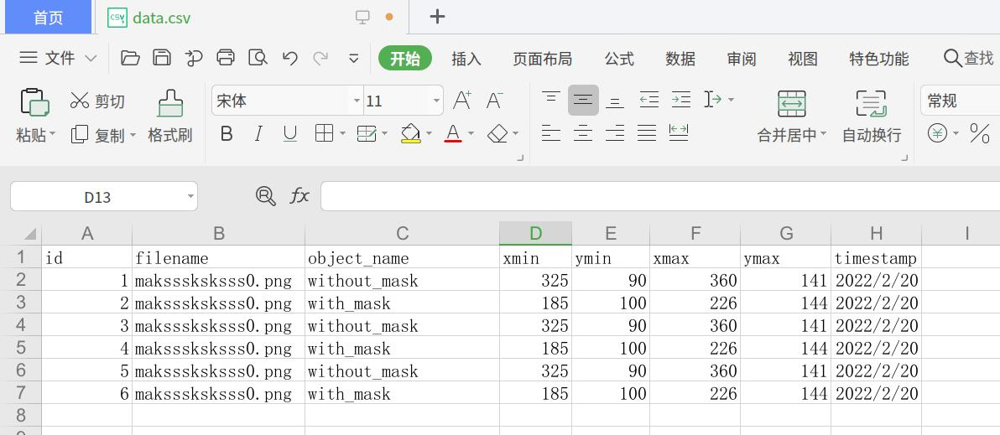

# Annotations_Images_Web

show your Annotations in JPEGImages | 在JPEG图像中显示注释信息


---

## 一、项目介绍

或许你手头上拿到一份数据集，这个数据集可能是网络收集的，也可能是自己标注整理的。
假设目前已经做好数据清洗等工作，你下一步就打算开始进行训练。
在正式开始之前，你也许将对于这些数据重新进行一个审查和分析，
这时候就需要将数据集中对应的图像文件和标注文件进行一个标注信息的显示，
因此，就考虑开发设计一个类似的数据集显示分析小工具。


### 1.1 项目展示

参考了一些开源的代码，也几经辗转，终于得到了还算勉强的效果。
结果如下：

#### 1.1.1 主界面



#### 1.1.2 实际效果




## 二、运行方式

### 2.1  安装要求

- django == 2.0

- opencv-python


### 2.2 项目目录

```yaml
/home/linxu/Documents/MyGithub/Annotations_Images_Web
├── db.sqlite3                                        # sqlite
├── Files											  # 数据存放路径
│   ├── data.csv
│   └── default.jpg
├── imagedetector									  # Django-web相关代码
│   ├── asgi.py
│   ├── __init__.py
│   ├── settings.py
│   ├── urls.py
│   └── wsgi.py
├── main											  # 标注显示相关代码
│   ├── admin.py
│   ├── apps.py
│   ├── forms.py
│   ├── __init__.py
│   ├── migrations
│   │   ├── 0001_initial.py
│   │   ├── 0002_alter_imagedata_timestamp.py
│   │   ├── __init__.py
│   ├── models.py
│   ├── templates
│   │   ├── index.html
│   │   └── test.html
│   ├── tests.py
│   ├── urls.py
│   ├── utils.py									  # utils支持修改颜色和读图片 
│   └── views.py
├── manage.py
├── README.md
├── requirements.txt
├── test
│   ├── Annotations
│   │   └── maksssksksss0.xml
│   ├── JPEGImages
│   │   └── maksssksksss0.jpg
│   └── maksssksksss0.jpg
└── web_src
    ├── src_1.jpg
    └── src_2.jpg
```


### 2.3 运行

```shell
git clone https://github.com/isLinXu/Annotations_Images_Web.git
```


```shell
cd Annotations_Images_Web
```

```shell
python manage.py migrate
```




```shell
python manage.py runserver
```



### 2.4 操作

进入主页面后，有最上面一栏有两个选项，

- 一个是Image Scan，用来导入图片文件和标注文件。
- 另一个是Generate Report，用来输出报告。




在这里进行图片文件传入，注意目前格式仅支持.jpg文件。



在这里进行标注文件传入，目前只支持.xml格式文件。



两者的名称要注意保持对应的一致，否则可能会出错。

最后点击最下面的Commit进行提交就可以显示出相关信息啦。


如果这时候还需要生成报告的话，可以点Generate Report来进行报告的生成。
这里还可以根据日期时间来进行相应的筛选。




生成的报告会以.csv文件的形式进行保存，你可以对它进行下载到本地路径。




